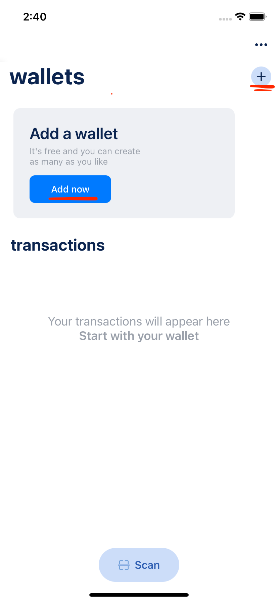
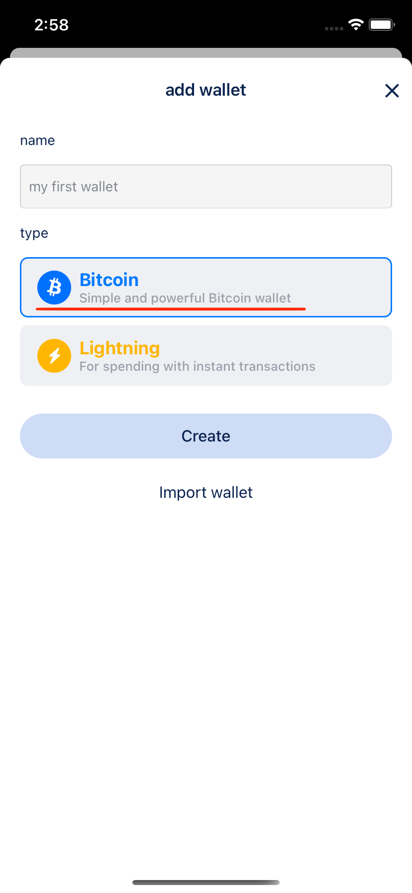
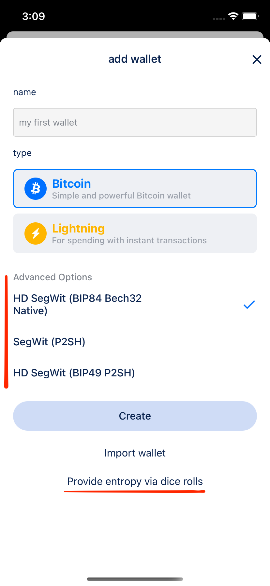
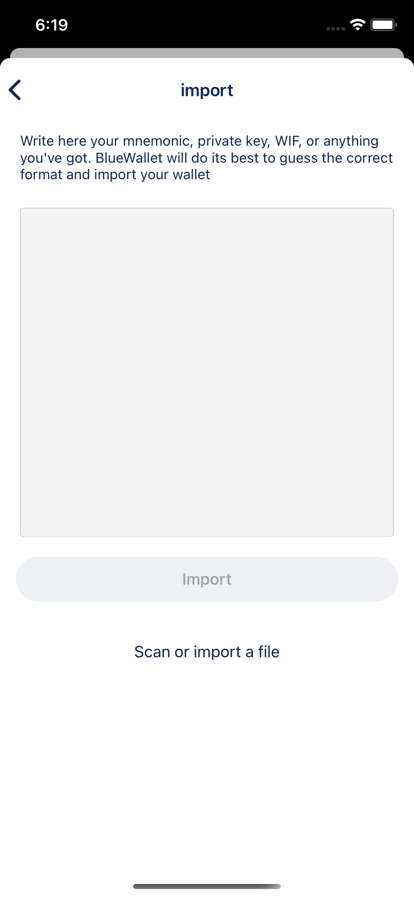

# How to create a Bitcoin wallet

Creating a Bitcoin wallet on BlueWallet is easy.

You can either click on the "Add now" button or the "+" icon in the top right corner

That will take you to the "add wallet" screen.

## Adding a new wallet

In the "add wallet" screen, you can choose between a Bitcoin wallet and a Lightning wallet.

For Bitcoin, click on the Bitcoin button. (If you want to create a Lightning wallet, see [this guide](./create-lightning-wallet.md).)

You may also name your wallet, or leave the default name.

### Advanced options

If you have "Advanced mode" enabled in general settings,
you'll see more options for creating the wallet.

#### Wallet type

The first group of options is for the wallet type:

##### HD SegWit (BIP84 Bech32 Native)

???

##### SegWit (P2SH)

???

###### HD SegWit (BIP49 PS2H)

???

#### Manual entropy

BlueWallet supports manual entropy. See [here](./manual-entropy.md) for more details.

When you're ready, you can click on "Create" to make your new wallet.

### Importing a wallet

Instead of creating a new wallet, you can chose to import a wallet from another source or a wallet that you've previously created on BlueWallet.

Click on "Import wallet" to open the import screen.

In this text area you can post your: mnemonic, private key or WIF.

#### Mnemonic

???

#### Private key

???

#### WIF

???

#### ??? What else can the user import

After you've entered your import source in the text area, click "Import" to create an imported wallet.

#### Scanning or importing a file

What is this feature for??? What can you scan? What type of file can you import?
