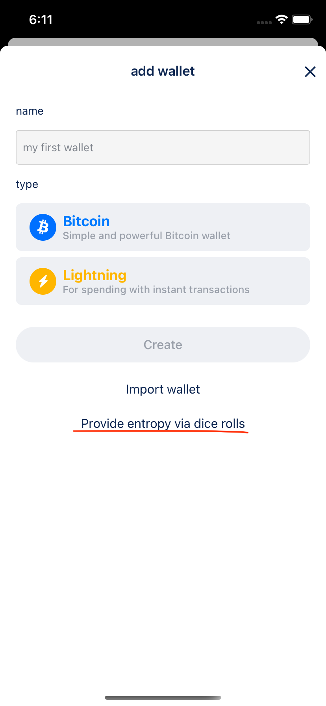
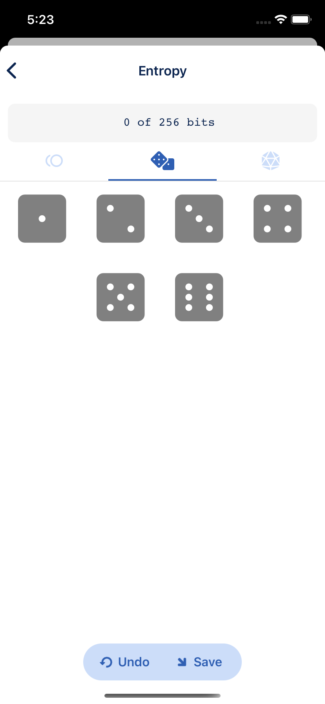
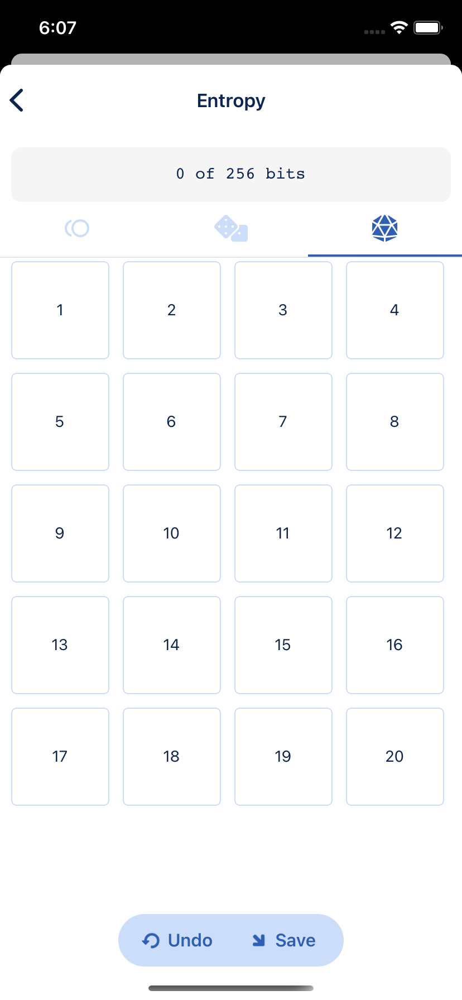
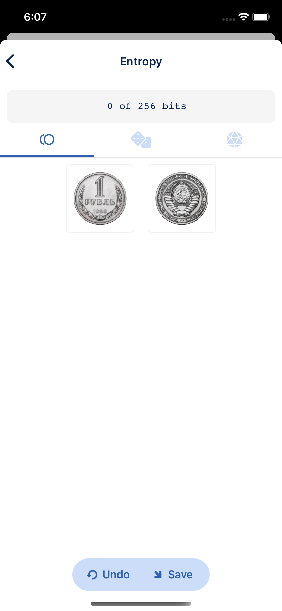
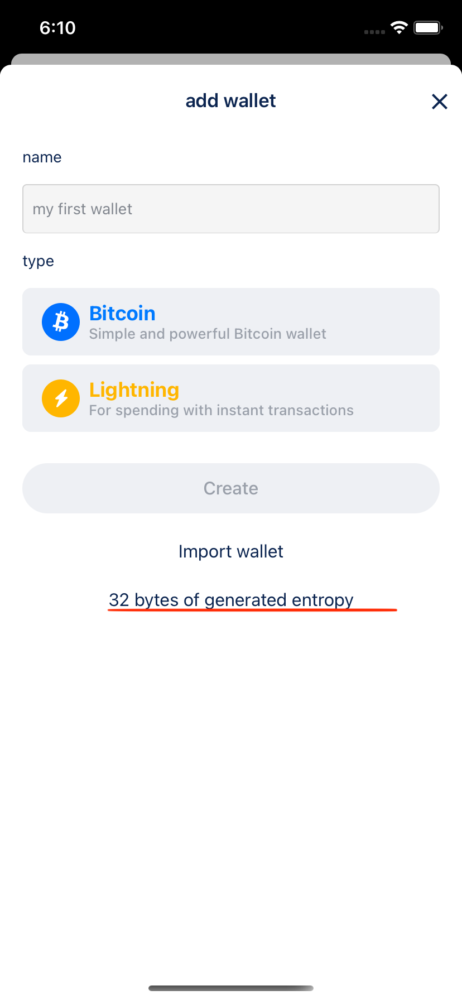
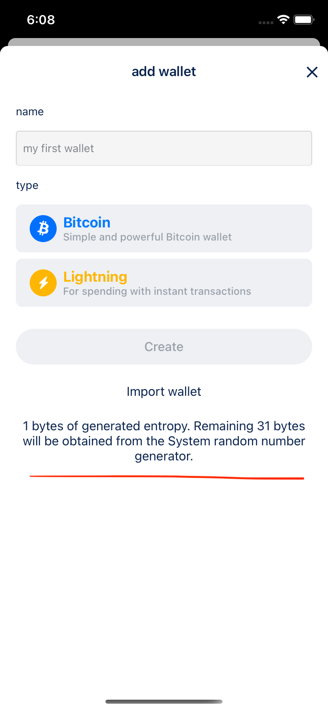

# Manual Entropy

BlueWallet supports manual entropy.

To use this feature, go to:

`Settings` => `General` then toggle on `Advanced mode`.

Now when you go back to the "add wallet" screen, you will see the option to add manual entropy.

This option is available for both Bitcoin and Lightning wallets.

You can choose to provide a custom source of entropy for your wallet, either by a coin flip, 6-sided dice roll, or 20-sided dice roll.

## Supported sources of entropy

### 6-sided dice roll

### 20-sided dice roll

### Coin flip

When you're done entering your entropy, click "Save" to go back to the "add wallet" screen.

You should see a note at the bottom of the screen informing you that your saved entropy is being used:

If you didn't provide all the 256 of entropy, BlueWallet will use the system's random number generator to obtain the remaining bytes. In that case you'll see a message like this:

